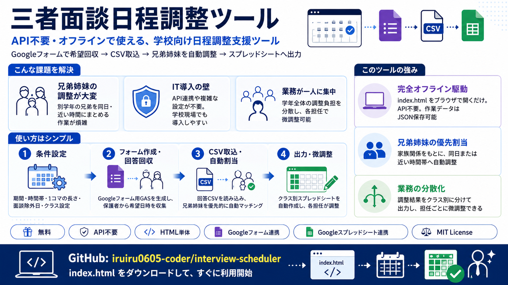
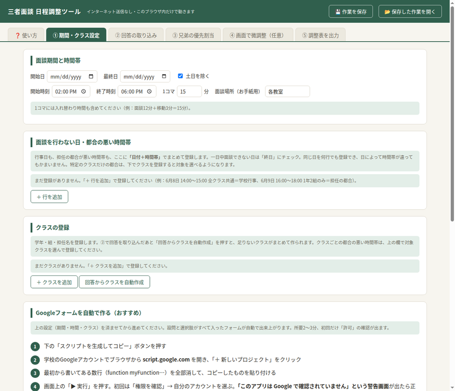
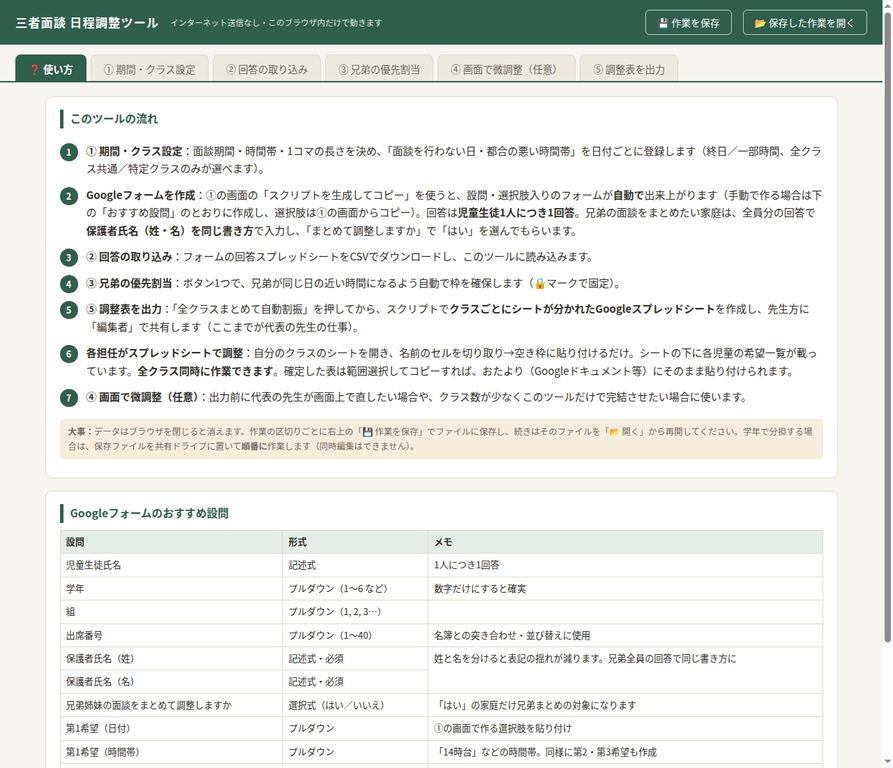
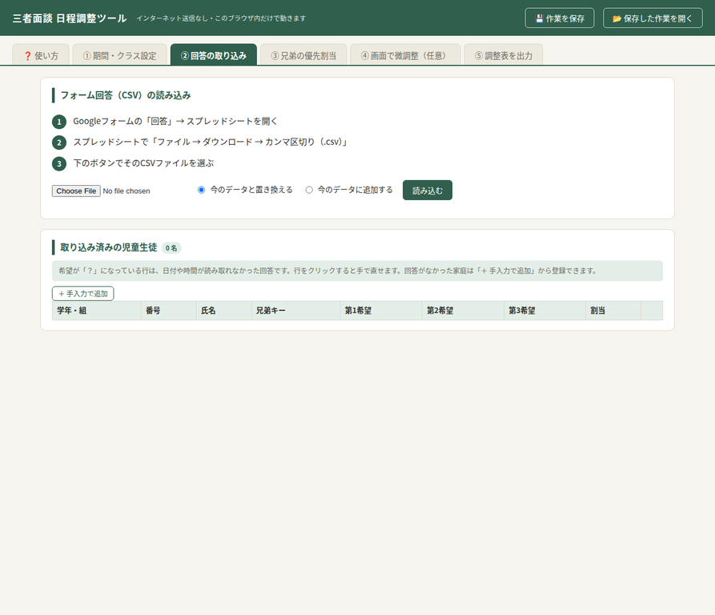
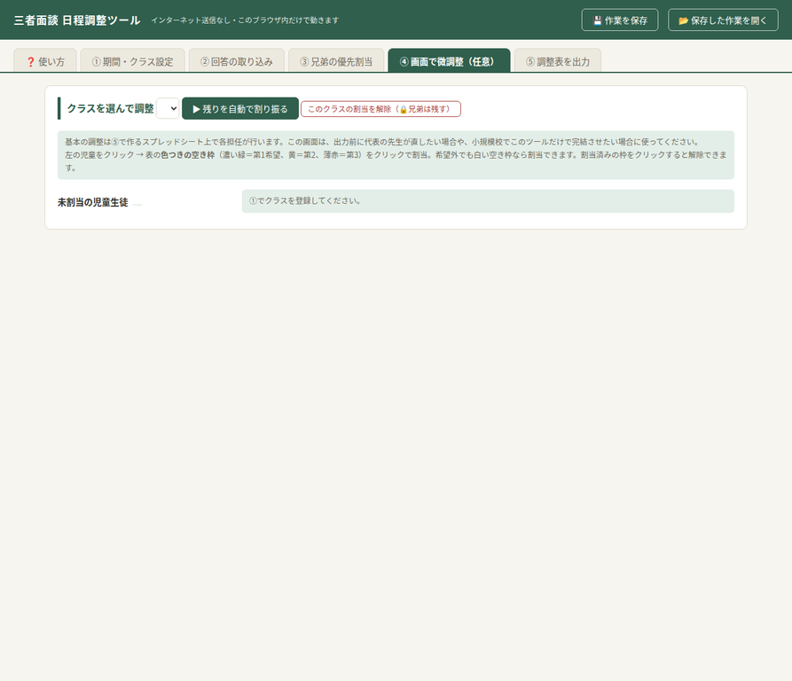

# 三者面談日程調整ツール

## 概要

このツールは、小中学校の先生方が三者面談の日程調整を効率的に行うために開発された、HTMLベースのオフラインアプリケーションです。GoogleフォームとGoogleスプレッドシートを活用することで、APIキーなどの複雑な設定なしに、現場の先生方が手軽に利用できることを目指しています。

## ✨ 特徴

*   **API不要**: GoogleフォームとGoogleスプレッドシートの基本的な機能のみを使用するため、APIキーの取得や設定は一切不要です。
*   **HTMLファイル単体で動作**: ダウンロードしたHTMLファイルをブラウザで開くだけで動作します。インターネット接続は初期ダウンロード時のみ必要で、作業中はオフラインで利用可能です。
*   **Googleフォーム連携**: 面談希望日の収集にはGoogleフォームを利用します。ツール内でGoogleフォームの設問スクリプトを自動生成できるため、簡単にフォームを作成できます。
*   **Googleスプレッドシート連携**: 調整結果はGoogleスプレッドシートに出力され、各クラスの担任が個別に微調整を行えるようになっています。これにより、一人の先生に作業が集中するのを防ぎます。
*   **兄弟姉妹の面談調整**: 兄弟姉妹がいる家庭の場合、面談日時をまとめて調整する機能が組み込まれています。
*   **オフライン作業保存**: 作業途中のデータはJSONファイルとしてローカルに保存・読み込みが可能です。

## 🚀 使い方

### 1. ツールの準備

1.  このリポジトリから`index.html`ファイルをダウンロードし、お使いのパソコンに保存します。
2.  ダウンロードした`index.html`ファイルをダブルクリックして、ウェブブラウザで開きます。

### 2. 面談期間・クラス設定

面談の期間、時間帯、1コマの長さ、面談を行わない日などを設定します。Googleフォームの設問スクリプトもここで生成できます。

### 3. Googleフォームの作成と回答収集

ツールで生成したスクリプトを使ってGoogleフォームを自動作成し、保護者から面談希望を収集します。

### 4. 回答の取り込み

Googleフォームの回答スプレッドシートからCSVをダウンロードし、ツールに読み込みます。

### 5. 兄弟の優先割当（任意）

兄弟姉妹の面談を同じ日の近い時間に自動で割り当てます。

### 6. 調整表の出力

調整結果をGoogleスプレッドシートに出力し、各担任が微調整できるようにします。

### 7. 各担任による微調整

共有されたGoogleスプレッドシート上で、各担任が自分のクラスの面談日程を微調整します。

### 8. 画面での微調整（任意）

出力前に代表の先生が画面上で直接日程を調整したり、クラス数が少ない場合にこのツールだけで調整を完結させたりすることができます。

## 👨‍💻 開発者

iruiru

## 📄 ライセンス

[MIT License](LICENSE)
